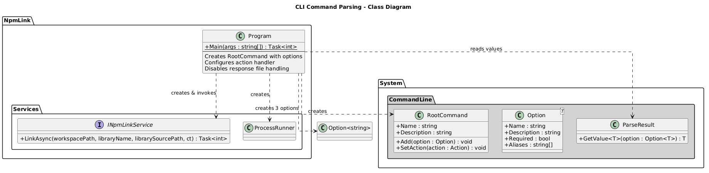
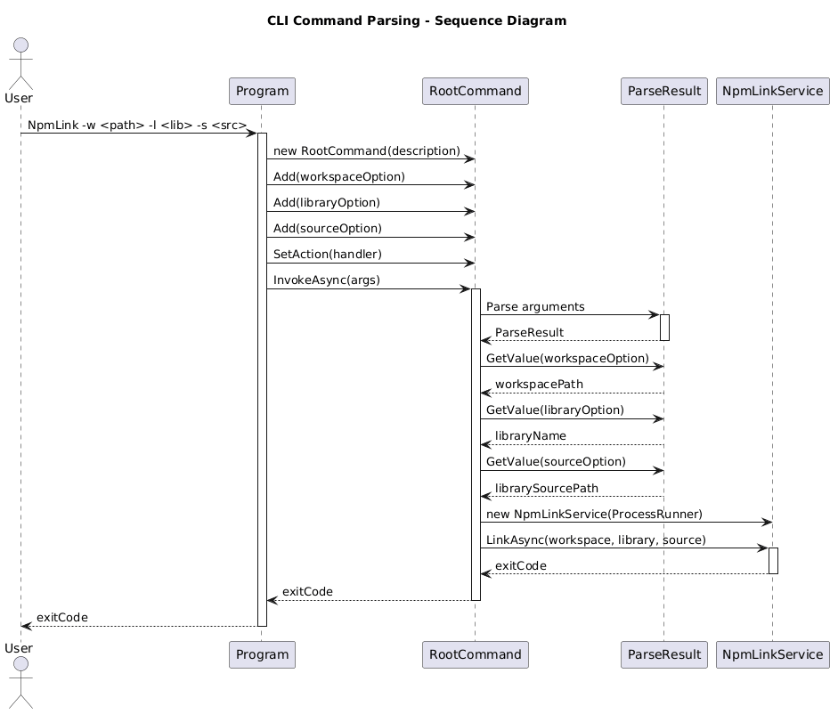

# CLI Command Parsing - Detailed Design

## Overview

The CLI Command Parsing feature is the entry point of the NpmLink application. It uses the `System.CommandLine` library (v3.0.0-preview) to define a root command with three required options, parse user input, and dispatch execution to the `NpmLinkService`. It also disables response file handling to support scoped npm package names (e.g., `@my-org/my-lib`) that would otherwise be misinterpreted as response file references.

## Components, Classes, and Interfaces

### Program (Static Class)

**File:** `src/NpmLink/Program.cs`

The `Program` class contains the `Main` entry point and is responsible for:

- **RootCommand creation** - Defines the CLI with a description: *"links a local library into an Angular workspace for local development and debugging"*.
- **Option definitions** - Creates three `Option<string>` instances:
  - `--workspace` / `-w` (required) - Path to the Angular workspace containing `angular.json`.
  - `--library` / `-l` (required) - Library name as it appears in `package.json`.
  - `--source` / `-s` (required) - Path to the library source directory containing `package.json`.
- **Action handler** - Registers an async action that extracts parsed values from `ParseResult`, constructs a `NpmLinkService` with a `ProcessRunner`, and invokes `LinkAsync`.
- **Response file disabling** - Calls `root.Options.ResponseFileHandling = ResponseFileHandling.Disabled` to prevent `@`-prefixed library names from being treated as response files.
- **Invocation** - Calls `root.InvokeAsync(args)` and returns the exit code.

### System.CommandLine Types Used

| Type | Purpose |
|------|---------|
| `RootCommand` | Top-level command container |
| `Option<string>` | Defines each CLI option with type, aliases, and required flag |
| `ParseResult` | Provides parsed option values via `GetValue<T>()` |
| `ResponseFileHandling` | Enum controlling response file behavior |

## Class Diagram

**PlantUML source:** [diagrams/cli-class.puml](diagrams/cli-class.puml)

## Sequence Diagram

**PlantUML source:** [diagrams/cli-sequence.puml](diagrams/cli-sequence.puml)

## Behaviour

1. The user invokes the CLI: `NpmLink -w ./app -l @my-org/my-lib -s ../lib`
2. `Program.Main` creates the `RootCommand` and adds three required `Option<string>` instances.
3. An async action handler is registered on the root command.
4. Response file handling is disabled to support `@`-prefixed package names.
5. `RootCommand.InvokeAsync(args)` parses the arguments.
6. The action handler extracts `workspacePath`, `libraryName`, and `librarySourcePath` from `ParseResult`.
7. A new `NpmLinkService` is instantiated with a `ProcessRunner`.
8. `LinkAsync` is called with the parsed values.
9. The exit code from `LinkAsync` is returned as the process exit code.

## Error Handling

- If required options are missing, `System.CommandLine` automatically displays usage help and returns a non-zero exit code.
- If `LinkAsync` fails, its exit code propagates to the process exit code.
