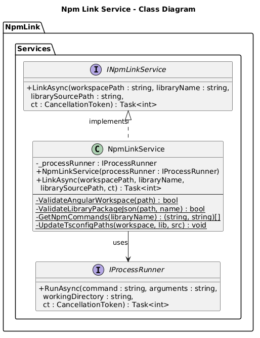
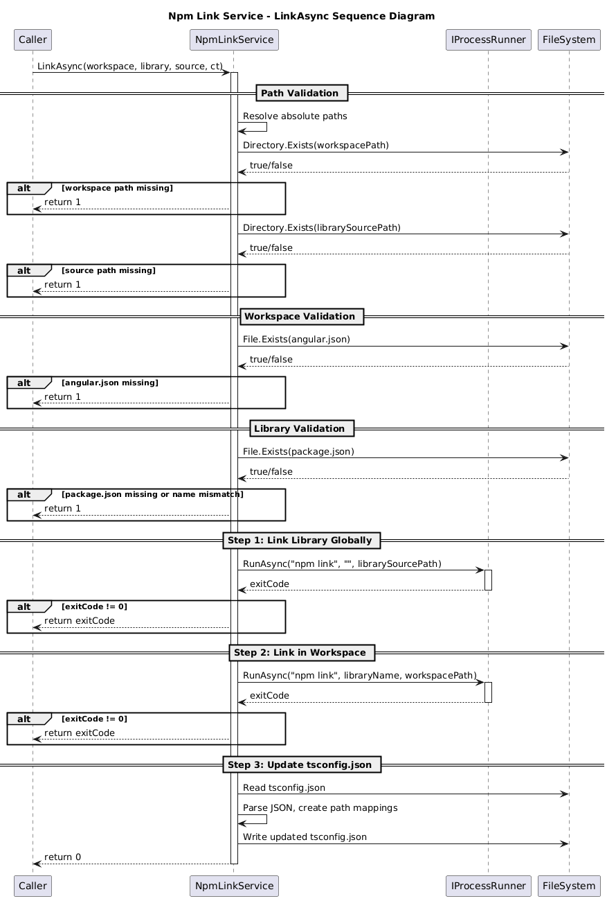

# Npm Link Service - Detailed Design

## Overview

The Npm Link Service is the core orchestrator of the NpmLink application. It coordinates the full workflow of linking a local npm library into an Angular workspace: validating inputs, executing npm link commands, and updating TypeScript configuration. The service follows the dependency injection pattern, accepting an `IProcessRunner` to enable testability and separation of concerns.

## Components, Classes, and Interfaces

### INpmLinkService (Interface)

**File:** `src/NpmLink/Services/INpmLinkService.cs`

Defines the contract for the linking operation:

```csharp
Task<int> LinkAsync(
    string workspacePath,
    string libraryName,
    string librarySourcePath,
    CancellationToken cancellationToken = default)
```

**Parameters:**
- `workspacePath` - Path to the Angular workspace root (must contain `angular.json`).
- `libraryName` - The npm package name (e.g., `@my-org/my-lib`).
- `librarySourcePath` - Path to the library source directory (must contain `package.json`).
- `cancellationToken` - Optional cancellation support.

**Returns:** Exit code (`0` = success, non-zero = error).

### NpmLinkService (Class)

**File:** `src/NpmLink/Services/NpmLinkService.cs`

Implements `INpmLinkService` and contains the full linking workflow.

**Constructor:**
- Accepts `IProcessRunner` for executing external processes.

**Public Methods:**
- `LinkAsync(...)` - Orchestrates the three-step linking process.

**Private Static Methods:**

| Method | Purpose |
|--------|---------|
| `ValidateAngularWorkspace(workspacePath)` | Checks for `angular.json` in workspace root |
| `ValidateLibraryPackageJson(librarySourcePath, libraryName)` | Validates `package.json` exists and `name` field matches |
| `GetNpmCommands(libraryName)` | Returns platform-specific npm commands (Windows: `cmd /c npm`, Unix: `npm`) |
| `UpdateTsconfigPaths(workspacePath, libraryName, librarySourcePath)` | Updates `tsconfig.json` with path mappings |

**Workflow Steps:**
1. Resolve paths to absolute and validate directories exist.
2. Validate Angular workspace (`angular.json` presence).
3. Validate library (`package.json` existence and name match).
4. Execute `npm link` in the library source directory.
5. Execute `npm link <libraryName>` in the workspace directory.
6. Update `tsconfig.json` path mappings.

## Class Diagram



**PlantUML source:** [diagrams/npm-link-service-class.puml](diagrams/npm-link-service-class.puml)

## Sequence Diagram



**PlantUML source:** [diagrams/npm-link-service-sequence.puml](diagrams/npm-link-service-sequence.puml)

## Behaviour

### Happy Path

1. `LinkAsync` is called with workspace path, library name, and library source path.
2. Both paths are resolved to absolute paths using `Path.GetFullPath`.
3. Directory existence is verified for both paths.
4. `angular.json` existence is verified in the workspace directory.
5. `package.json` is read and parsed from the library source; the `name` field is compared against the provided library name.
6. `npm link` is executed in the library source directory via `IProcessRunner`, registering the library globally.
7. `npm link <libraryName>` is executed in the workspace directory, creating the symlink.
8. `tsconfig.json` in the workspace is updated with path mappings pointing to the library source.
9. Exit code `0` is returned.

### Error Paths

| Condition | Exit Code | Subsequent Steps |
|-----------|-----------|-----------------|
| Workspace directory missing | 1 | None |
| Library source directory missing | 1 | None |
| `angular.json` missing | 1 | None |
| `package.json` missing or name mismatch | 1 | None |
| `npm link` (step 1) fails | npm exit code | Steps 2-3 skipped |
| `npm link <lib>` (step 2) fails | npm exit code | Step 3 skipped |
| `tsconfig.json` update fails | 0 | Warning logged (non-fatal) |

## Design Decisions

- **tsconfig failure is non-fatal**: The primary value is the npm link itself; tsconfig updates are a convenience. Failing silently with a warning avoids blocking the workflow for a secondary concern.
- **Early exit pattern**: Each validation check returns immediately on failure, preventing cascading errors.
- **Static helper methods**: Validation and update methods are static since they don't depend on instance state, improving testability of individual concerns.
