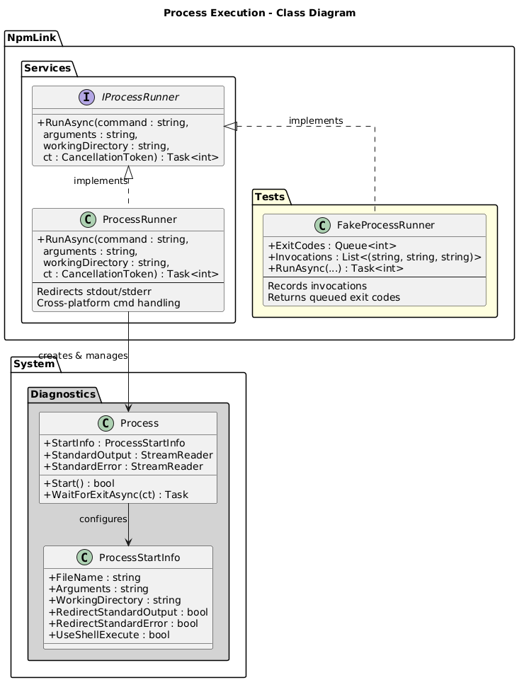
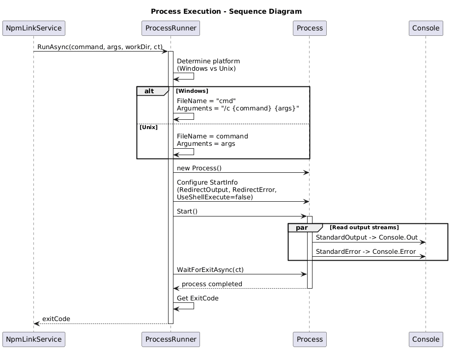

# Process Execution - Detailed Design

## Overview

The Process Execution feature provides an abstraction for running external system commands (specifically npm commands). It uses the `IProcessRunner` interface to decouple the service layer from `System.Diagnostics.Process`, enabling testability via a `FakeProcessRunner` test double. The `ProcessRunner` implementation handles cross-platform differences between Windows and Unix, redirects output streams, and supports async cancellation.

## Components, Classes, and Interfaces

### IProcessRunner (Interface)

**File:** `src/NpmLink/Services/IProcessRunner.cs`

```csharp
Task<int> RunAsync(
    string command,
    string arguments,
    string workingDirectory,
    CancellationToken cancellationToken = default)
```

**Parameters:**
- `command` - The executable to run (e.g., `cmd` on Windows, `npm` on Unix).
- `arguments` - Command-line arguments.
- `workingDirectory` - The directory in which to execute the process.
- `cancellationToken` - Optional cancellation support.

**Returns:** The process exit code.

### ProcessRunner (Class)

**File:** `src/NpmLink/Services/ProcessRunner.cs`

Production implementation of `IProcessRunner`.

**Responsibilities:**
- Creates and configures a `System.Diagnostics.Process` instance.
- Sets `ProcessStartInfo` properties: `FileName`, `Arguments`, `WorkingDirectory`, `RedirectStandardOutput`, `RedirectStandardError`, `UseShellExecute = false`.
- Reads stdout and stderr asynchronously and writes them to `Console.Out` and `Console.Error`.
- Awaits process completion via `WaitForExitAsync(cancellationToken)`.
- Returns the process exit code.

**Cross-Platform Handling:**
- On **Windows**: Wraps commands via `cmd /c <command> <args>`.
- On **Unix/macOS**: Runs the command directly.

### FakeProcessRunner (Test Double)

**File:** `tests/NpmLink.Tests/FakeProcessRunner.cs`

Test implementation of `IProcessRunner` used in unit tests.

**Properties:**
- `ExitCodes : Queue<int>` - Pre-configured exit codes returned in sequence.
- `Invocations : List<(string Command, string Arguments, string WorkingDirectory)>` - Records all calls for assertion.

**Behaviour:**
- Records each invocation's command, arguments, and working directory.
- Dequeues and returns the next exit code from the queue.
- Does not execute any actual processes.

## Class Diagram



**PlantUML source:** [diagrams/process-runner-class.puml](diagrams/process-runner-class.puml)

## Sequence Diagram



**PlantUML source:** [diagrams/process-runner-sequence.puml](diagrams/process-runner-sequence.puml)

## Behaviour

### ProcessRunner.RunAsync Execution Flow

1. The caller (NpmLinkService) invokes `RunAsync` with a command, arguments, and working directory.
2. The runner determines the current platform using `RuntimeInformation.IsOSPlatform`.
3. On Windows, the command is wrapped as `cmd /c <command> <arguments>`. On Unix, the command is used directly.
4. A new `Process` is created with `ProcessStartInfo` configured for:
   - Redirected standard output and standard error.
   - `UseShellExecute = false` (required for stream redirection).
5. The process is started.
6. Standard output and standard error are read asynchronously in parallel and forwarded to the console.
7. `WaitForExitAsync` is called with the cancellation token.
8. The exit code is extracted and returned to the caller.

### FakeProcessRunner Usage in Tests

1. The test configures `FakeProcessRunner` with a queue of expected exit codes (e.g., `[0, 0]` for two successful calls).
2. `NpmLinkService` calls `RunAsync` through the interface.
3. `FakeProcessRunner` records the invocation and returns the next queued exit code.
4. The test asserts on the recorded invocations to verify correct commands, arguments, and working directories were used.

## Design Decisions

- **Interface abstraction**: `IProcessRunner` enables unit testing without spawning real processes, which would be slow, flaky, and require npm to be installed.
- **Stream forwarding**: stdout and stderr are forwarded to the console in real-time so the user can see npm's output as it runs.
- **Cross-platform via cmd wrapping**: Using `cmd /c` on Windows ensures npm (a `.cmd` script) can be found and executed correctly.
