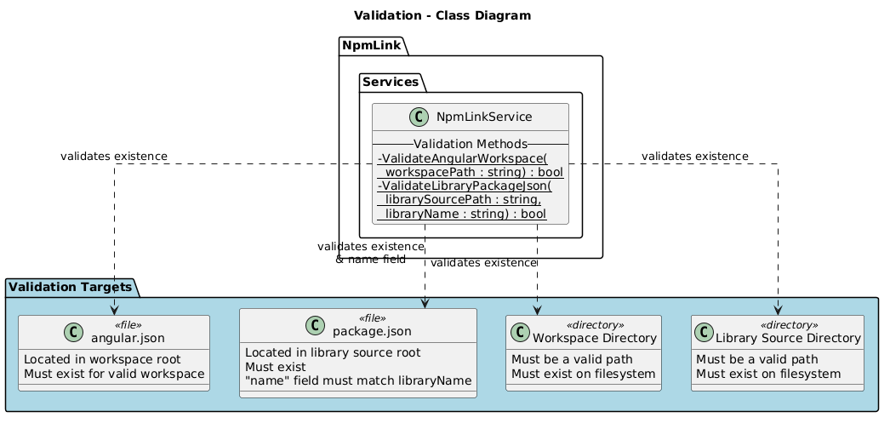
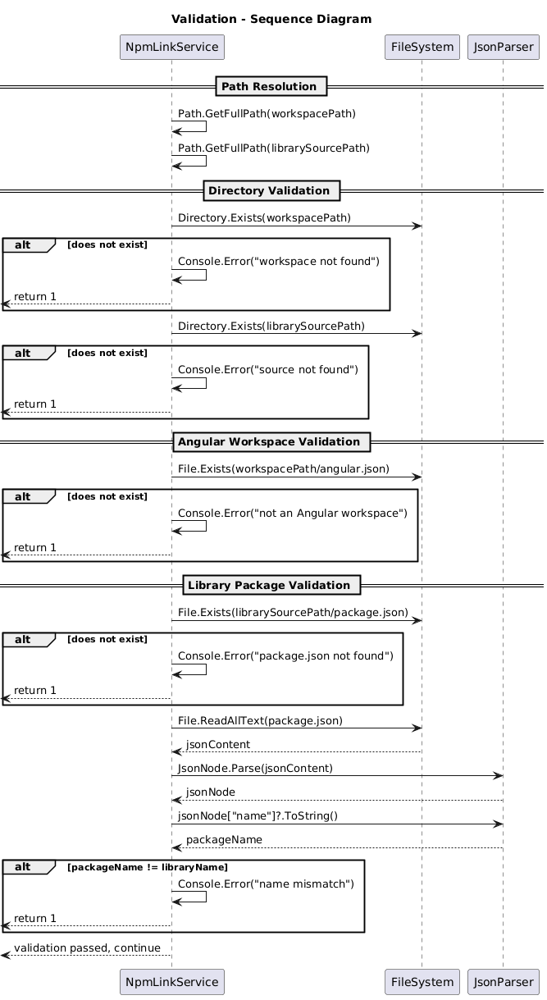

# Validation - Detailed Design

## Overview

The Validation feature performs multi-stage input validation before any npm commands are executed. It validates directory existence, Angular workspace presence, and library package identity. This fail-fast approach prevents partial execution of npm link commands that would leave the system in an inconsistent state if validation were deferred.

## Components, Classes, and Interfaces

### NpmLinkService - Validation Methods

**File:** `src/NpmLink/Services/NpmLinkService.cs`

All validation is performed within `NpmLinkService` via static helper methods called at the beginning of `LinkAsync`.

#### Path Validation (inline in LinkAsync)

- Converts both `workspacePath` and `librarySourcePath` to absolute paths using `Path.GetFullPath`.
- Checks `Directory.Exists` for both paths.
- Writes error to `Console.Error` and returns exit code `1` if either is missing.

#### ValidateAngularWorkspace (Static Method)

```csharp
static bool ValidateAngularWorkspace(string workspacePath)
```

- Checks for `angular.json` at the workspace root using `File.Exists(Path.Combine(workspacePath, "angular.json"))`.
- Returns `true` if the file exists, `false` otherwise.
- Caller writes error message and returns exit code `1` on failure.

#### ValidateLibraryPackageJson (Static Method)

```csharp
static bool ValidateLibraryPackageJson(string librarySourcePath, string libraryName)
```

- Checks for `package.json` at the library source root.
- If found, reads the file and parses it as JSON using `System.Text.Json.Nodes.JsonNode.Parse`.
- Extracts the `name` field and compares it to the expected `libraryName`.
- Returns `true` only if the file exists AND the name matches.
- Returns `false` if the file is missing, the JSON is invalid, or the name doesn't match.

### Validation Targets

| Target | Location | Check |
|--------|----------|-------|
| Workspace directory | `workspacePath` | `Directory.Exists` |
| Library source directory | `librarySourcePath` | `Directory.Exists` |
| `angular.json` | `workspacePath/angular.json` | `File.Exists` |
| `package.json` | `librarySourcePath/package.json` | `File.Exists` + JSON name match |

## Class Diagram



**PlantUML source:** [diagrams/validation-class.puml](diagrams/validation-class.puml)

## Sequence Diagram



**PlantUML source:** [diagrams/validation-sequence.puml](diagrams/validation-sequence.puml)

## Behaviour

### Validation Sequence

Validation runs in a strict order, with early exit on the first failure:

1. **Path resolution** - Both paths are converted to absolute paths.
2. **Workspace directory check** - If the workspace directory does not exist, log error and return `1`.
3. **Library source directory check** - If the source directory does not exist, log error and return `1`.
4. **Angular workspace check** - If `angular.json` is not found in the workspace, log error and return `1`.
5. **Library package check** - If `package.json` is missing or its `name` field does not match the provided library name, log error and return `1`.
6. **All validations pass** - Execution continues to the npm link steps.

### Test Coverage

The test suite in `NpmLinkServiceTests` covers all five validation failure scenarios:

| Test | Scenario | Expected |
|------|----------|----------|
| `LinkAsync_MissingWorkspacePath_ReturnsOne` | Non-existent workspace path | Returns 1, no processes invoked |
| `LinkAsync_MissingLibrarySourcePath_ReturnsOne` | Non-existent source path | Returns 1, no processes invoked |
| `LinkAsync_MissingAngularJson_ReturnsOne` | Workspace without `angular.json` | Returns 1, no processes invoked |
| `LinkAsync_MissingPackageJson_ReturnsOne` | Source without `package.json` | Returns 1, no processes invoked |
| `LinkAsync_PackageJsonNameMismatch_ReturnsOne` | `package.json` name differs from `--library` | Returns 1, no processes invoked |

## Design Decisions

- **Fail-fast ordering**: Directory checks run before file checks. This provides the most actionable error messages (e.g., "directory not found" vs. "file not found in non-existent directory").
- **No process invocations on validation failure**: Tests verify that `FakeProcessRunner.Invocations` is empty when validation fails, confirming no npm commands are executed.
- **Static methods**: Validation logic is stateless and side-effect-free (aside from console output), making it easy to reason about and test.
