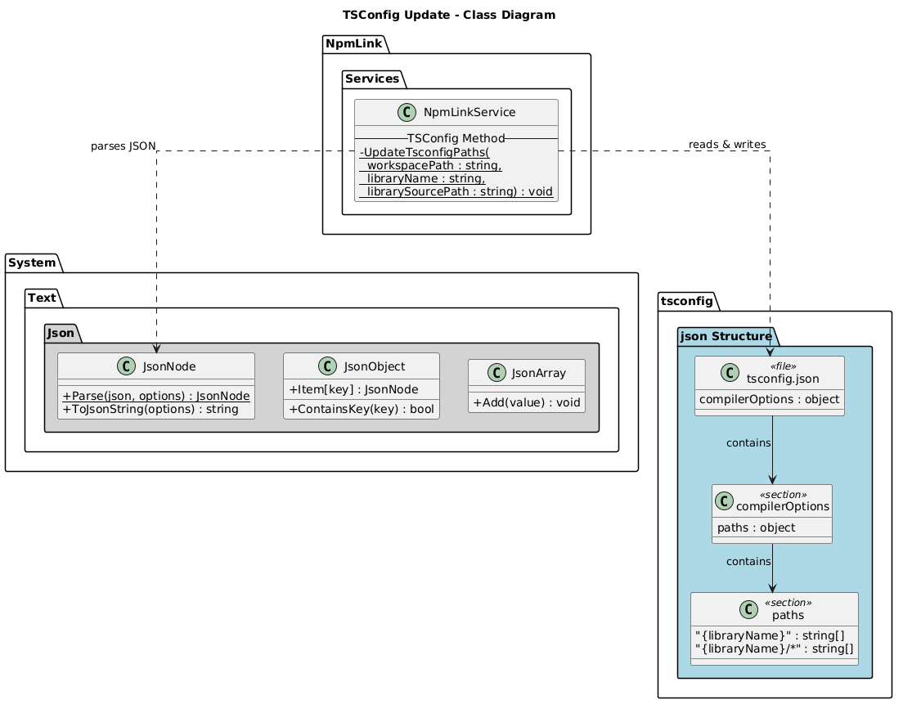
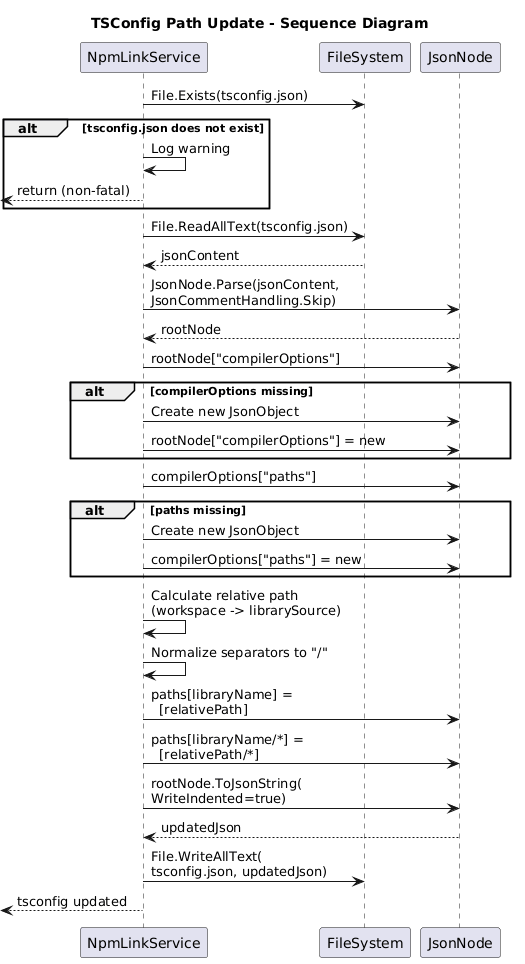

# TSConfig Path Update - Detailed Design

## Overview

The TSConfig Path Update feature modifies the `tsconfig.json` file in the Angular workspace to add TypeScript path mappings that point to the linked library source. This enables the TypeScript compiler and IDE tooling to resolve imports from the library to the local source code rather than `node_modules`, providing proper IntelliSense and debugging support during local development.

## Components, Classes, and Interfaces

### NpmLinkService.UpdateTsconfigPaths (Static Method)

**File:** `src/NpmLink/Services/NpmLinkService.cs`

```csharp
static void UpdateTsconfigPaths(
    string workspacePath,
    string libraryName,
    string librarySourcePath)
```

**Responsibilities:**
- Reads `tsconfig.json` from the workspace root.
- Parses JSON using `System.Text.Json.Nodes.JsonNode` with `JsonCommentHandling.Skip` to tolerate `//` comments in tsconfig files.
- Ensures the `compilerOptions` and `paths` objects exist, creating them if absent.
- Calculates the relative path from the workspace to the library source directory.
- Normalizes path separators to forward slashes for cross-platform JSON compatibility.
- Adds two path mappings:
  - `libraryName` → `["<relativePath>"]`
  - `libraryName/*` → `["<relativePath>/*"]`
- Writes the updated JSON back with indented formatting.

### Path Mapping Structure

Given:
- Workspace: `C:\projects\my-app`
- Library: `@my-org/my-lib`
- Source: `C:\projects\my-lib`

The resulting `tsconfig.json` paths:

```json
{
  "compilerOptions": {
    "paths": {
      "@my-org/my-lib": ["../my-lib"],
      "@my-org/my-lib/*": ["../my-lib/*"]
    }
  }
}
```

### System.Text.Json Types Used

| Type | Purpose |
|------|---------|
| `JsonNode` | Root parsing and tree manipulation |
| `JsonObject` | Represents `compilerOptions` and `paths` objects |
| `JsonArray` | Holds the array of path strings for each mapping |
| `JsonDocumentOptions` | Configures `JsonCommentHandling.Skip` |
| `JsonSerializerOptions` | Configures `WriteIndented = true` for output |

## Class Diagram



**PlantUML source:** [diagrams/tsconfig-class.puml](diagrams/tsconfig-class.puml)

## Sequence Diagram



**PlantUML source:** [diagrams/tsconfig-sequence.puml](diagrams/tsconfig-sequence.puml)

## Behaviour

### Happy Path (tsconfig.json exists)

1. `UpdateTsconfigPaths` is called after both npm link steps succeed.
2. `tsconfig.json` is read from the workspace root.
3. The JSON is parsed with comment handling enabled (Angular tsconfigs commonly contain comments).
4. The `compilerOptions` object is accessed or created if absent.
5. The `paths` object within `compilerOptions` is accessed or created if absent.
6. The relative path from workspace to library source is computed using `Path.GetRelativePath`.
7. Backslashes are replaced with forward slashes for JSON compatibility.
8. Two entries are added/updated in the `paths` object:
   - `libraryName` maps to `[relativePath]`
   - `libraryName/*` maps to `[relativePath/*]`
9. The JSON tree is serialized with indentation and written back to `tsconfig.json`.

### Edge Cases

| Scenario | Behaviour |
|----------|-----------|
| `tsconfig.json` does not exist | Method returns silently; no file is created. Overall operation succeeds. |
| `compilerOptions` missing in JSON | A new `compilerOptions` object is created and added. |
| `paths` missing in `compilerOptions` | A new `paths` object is created and added. |
| Existing path entries for same library | Entries are overwritten with new values. |
| JSON contains `//` comments | Comments are skipped during parsing (but may be lost in output). |
| Update throws exception | Exception is caught by the caller; a warning is logged to stderr. The overall operation still returns `0`. |

### Test Coverage

| Test | Scenario | Assertion |
|------|----------|-----------|
| `LinkAsync_WithTsconfig_UpdatesPathMappings` | tsconfig exists with empty compilerOptions | Both path mappings are present in updated file |
| `LinkAsync_WithoutTsconfig_SucceedsWithoutError` | No tsconfig in workspace | Operation returns 0, no error thrown |
| `LinkAsync_TsconfigPathValues_ContainRelativePath` | Valid workspace and source paths | Path values contain correct relative paths with `/` separators |

## Design Decisions

- **Non-fatal on failure**: tsconfig update is a convenience feature. The primary value of NpmLink is the npm link itself. A tsconfig parse/write failure should not cause the overall operation to fail.
- **Comment handling**: Angular projects frequently have comments in `tsconfig.json`. Using `JsonCommentHandling.Skip` prevents parse failures, though comments may be stripped in the output.
- **Forward slash normalization**: TypeScript and Node.js use forward slashes in paths regardless of platform. The path is normalized to ensure cross-platform compatibility.
- **Two path entries**: The base entry (`@my-org/my-lib`) resolves the main package import, while the wildcard entry (`@my-org/my-lib/*`) resolves deep imports into the library.
